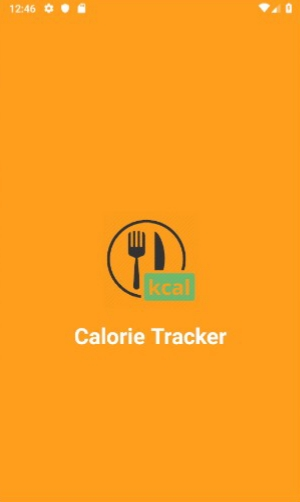
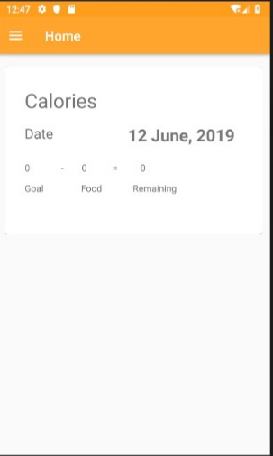
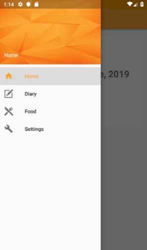
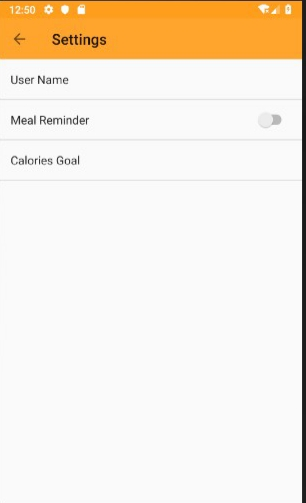
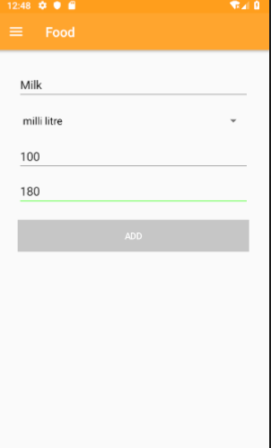
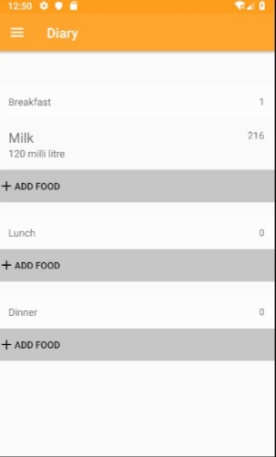

# CalorieTrackerAndroid

Calorie Tracker is an Android application which keeps track of your daily calorie intake. You can add multiple foods along with their quantity(units) and the calories in that quantity.

### User Interface

### Features
- Set user name & calories goal.
- Add new food along with its calories.
- Update your diary for breakfast, lunch and dinner.
- Keep track of calories remaining for a day.

### Requirements
- Android Studio
- gradle 4.4

